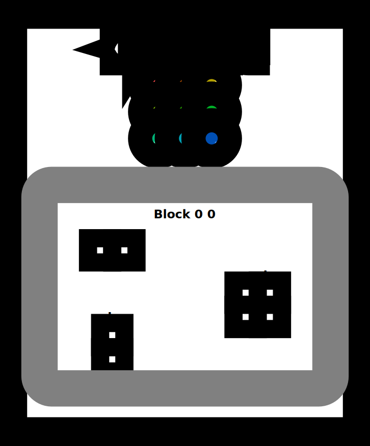
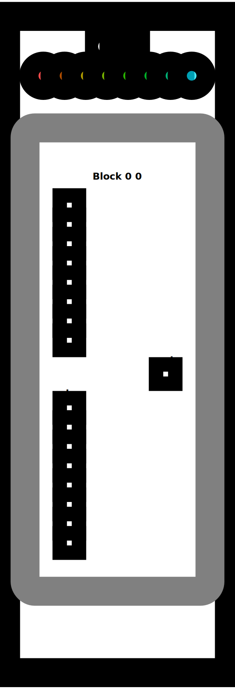
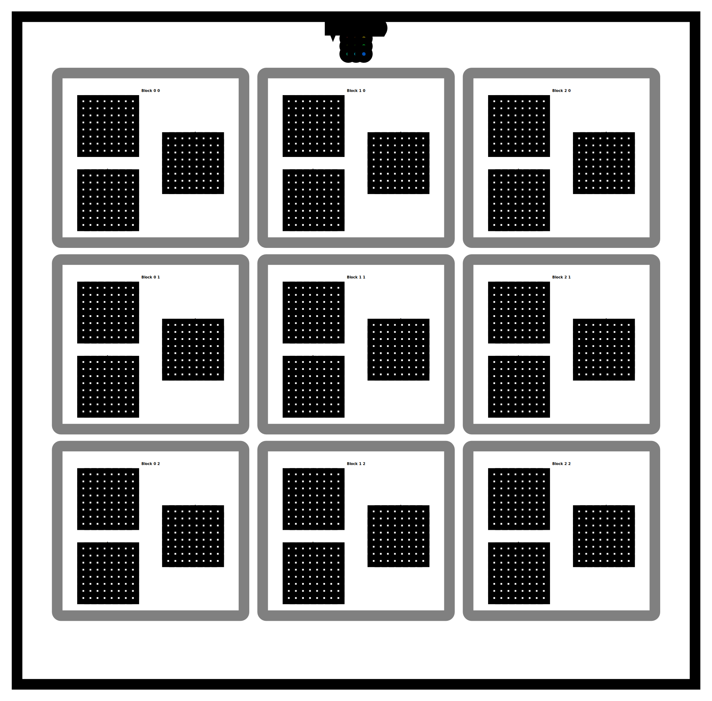
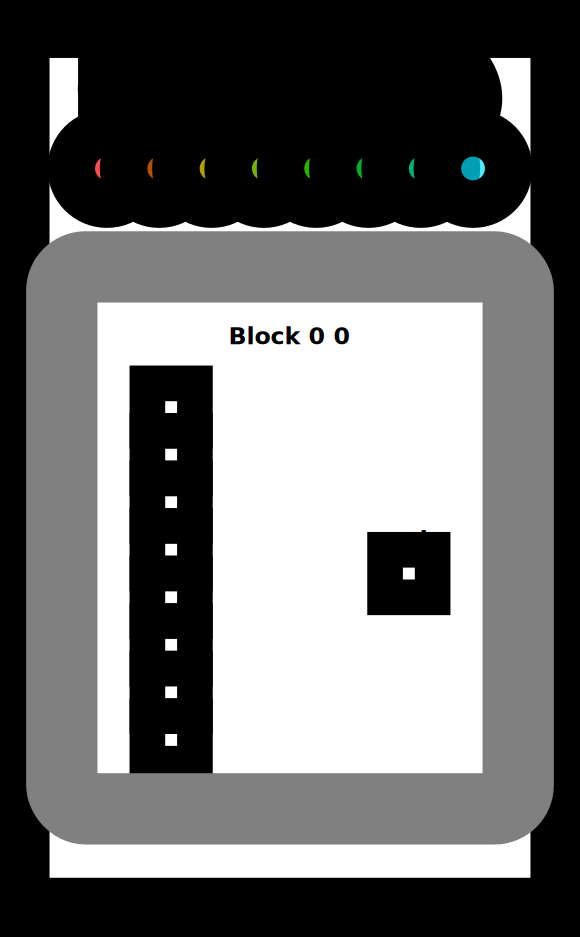

# GPU Puzzles
- by [Sasha Rush](http://rush-nlp.com) - [srush_nlp](https://twitter.com/srush_nlp)

[](https://colab.research.google.com/github/srush/GPU-Puzzles/blob/main/GPU_puzzlers.ipynb)


```python

```

GPU architectures are critical to machine learning, and seem to be
becoming even more important every day.  This notebook is an attempt
teach GPU programming in a completely interactive fashion by having
you solve puzzles on your own. Instead of providing a
textual guide that tries to explain the concepts, it throws you
right in to coding and building GPU kernels. In a few hours, I think
you can go from basics to understanding the key algorithms.

I recommend doing these in Colab, as it is easy to get started.
Be sure to turn on GPU mode in the settings and then get coding. 


(If you are into this style of puzzle, also check out my [Tensor
Puzzles](https://github.com/srush/Tensor-Puzzles) for PyTorch.)


```python
!pip install -qqq git+https://github.com/danoneata/chalk@srush-patch-1
!wget -q https://github.com/srush/GPU-Puzzles/raw/main/robot.png https://github.com/srush/GPU-Puzzles/raw/main/lib.py
```


```python
import numba
import numpy as np
import warnings
from lib import CudaProblem, Coord
```


```python
warnings.filterwarnings(
    action="ignore", category=numba.NumbaPerformanceWarning, module="numba"
)
```

## Puzzle 1: Map

Implement a "kernel" (GPU function) that adds 10 to each position of vector `a`
and stores it in vector `out`.  You have 1 thread per position.

*Tip: Think of the function `call` as being run 1 time for each thread.
The only difference is that `cuda.threadIdx.x` changes each time.*


```python
def map_spec(a):
    return a + 10
```


```python
def map_test(cuda):
    def call(out, a) -> None:
        local_i = cuda.threadIdx.x
        # FILL ME IN (roughly 1 lines)

    return call
```


```python
SIZE = 4
out = np.zeros((SIZE,))
a = np.arange(SIZE)
problem = CudaProblem(
    "Map", map_test, [a], out, threadsperblock=Coord(SIZE, 1), spec=map_spec
)
problem.show()
```

    # Map
     
       Score (Max Per Thread):
       |  Global Reads | Global Writes |  Shared Reads | Shared Writes |
       |             0 |             0 |             0 |             0 | 
    


    

    


```python
problem.check()
```

    Failed Tests.
    Yours: [0. 0. 0. 0.]
    Spec : [10 11 12 13]


## Puzzle 2 - Zip

Implement a kernel that adds together each position of `a` and `b` and stores it in `out`.
You have 1 thread per position.


```python
def zip_spec(a, b):
    return a + b
```


```python
def zip_test(cuda):
    def call(out, a, b) -> None:
        local_i = cuda.threadIdx.x
        # FILL ME IN (roughly 1 lines)

    return call
```


```python
SIZE = 4
out = np.zeros((SIZE,))
a = np.arange(SIZE)
b = np.arange(SIZE)
problem = CudaProblem(
    "Zip", zip_test, [a, b], out, threadsperblock=Coord(SIZE, 1), spec=zip_spec
)
problem.show()
```

    # Zip
     
       Score (Max Per Thread):
       |  Global Reads | Global Writes |  Shared Reads | Shared Writes |
       |             0 |             0 |             0 |             0 | 
    


    

    


```python
problem.check()
```

    Failed Tests.
    Yours: [0. 0. 0. 0.]
    Spec : [0 2 4 6]


## Puzzle 3 - Guards

Implement a kernel that adds 10 to each position of `a` and stores it in `out`.
You have more threads than positions.


```python
def map_guard_test(cuda):
    def call(out, a, size) -> None:
        local_i = cuda.threadIdx.x
        # FILL ME IN (roughly 2 lines)

    return call
```


```python
SIZE = 4
out = np.zeros((SIZE,))
a = np.arange(SIZE)
problem = CudaProblem(
    "Guard",
    map_guard_test,
    [a],
    out,
    [SIZE],
    threadsperblock=Coord(8, 1),
    spec=map_spec,
)
problem.show()
```

    # Guard
     
       Score (Max Per Thread):
       |  Global Reads | Global Writes |  Shared Reads | Shared Writes |
       |             0 |             0 |             0 |             0 | 
    


    

    


```python
problem.check()
```

    Failed Tests.
    Yours: [0. 0. 0. 0.]
    Spec : [10 11 12 13]


## Puzzle 4 - Map 2D

Implement a kernel that adds 10 to each position of `a` and stores it in `out`.
Input `a` is 2D and square. You have more threads than positions.


```python
def map_2D_test(cuda):
    def call(out, a, size) -> None:
        local_i = cuda.threadIdx.x
        local_j = cuda.threadIdx.y
        # FILL ME IN (roughly 2 lines)

    return call
```


```python
SIZE = 2
out = np.zeros((SIZE, SIZE))
a = np.arange(SIZE * SIZE).reshape((SIZE, SIZE))
problem = CudaProblem(
    "Map 2D", map_2D_test, [a], out, [SIZE], threadsperblock=Coord(3, 3), spec=map_spec
)
problem.show()
```

    # Map 2D
     
       Score (Max Per Thread):
       |  Global Reads | Global Writes |  Shared Reads | Shared Writes |
       |             0 |             0 |             0 |             0 | 
    


    

    


```python
problem.check()
```

    Failed Tests.
    Yours: [[0. 0.]
     [0. 0.]]
    Spec : [[10 11]
     [12 13]]


## Puzzle 5 - Broadcast

Implement a kernel that adds `a` and `b` and stores it in `out`.
Inputs `a` and `b` are vectors. You have more threads than positions.


```python
def broadcast_test(cuda):
    def call(out, a, b, size) -> None:
        local_i = cuda.threadIdx.x
        local_j = cuda.threadIdx.y
        # FILL ME IN (roughly 2 lines)

    return call
```


```python
SIZE = 2
out = np.zeros((SIZE, SIZE))
a = np.arange(SIZE).reshape(SIZE, 1)
b = np.arange(SIZE).reshape(1, SIZE)
problem = CudaProblem(
    "Broadcast",
    broadcast_test,
    [a, b],
    out,
    [SIZE],
    threadsperblock=Coord(3, 3),
    spec=zip_spec,
)
problem.show()
```

    # Broadcast
     
       Score (Max Per Thread):
       |  Global Reads | Global Writes |  Shared Reads | Shared Writes |
       |             0 |             0 |             0 |             0 | 
    


    

    


```python
problem.check()
```

    Failed Tests.
    Yours: [[0. 0.]
     [0. 0.]]
    Spec : [[0 1]
     [1 2]]


## Puzzle 6 - Blocks

Implement a kernel that adds 10 to each position of `a` and stores it in `out`.
You have less threads per block than the size of `a`.

*Tip: A block is a group of threads. The number of threads per block is limited, but we can
have many different blocks. Variable `cuda.blockIdx` tells us what block we are in.*


```python
def map_block_test(cuda):
    def call(out, a, size) -> None:
        i = cuda.blockIdx.x * cuda.blockDim.x + cuda.threadIdx.x
        # FILL ME IN (roughly 2 lines)

    return call
```


```python
SIZE = 9
out = np.zeros((SIZE,))
a = np.arange(SIZE)
problem = CudaProblem(
    "Blocks",
    map_block_test,
    [a],
    out,
    [SIZE],
    threadsperblock=Coord(4, 1),
    blockspergrid=Coord(3, 1),
    spec=map_spec,
)
problem.show()
```

    # Blocks
     
       Score (Max Per Thread):
       |  Global Reads | Global Writes |  Shared Reads | Shared Writes |
       |             0 |             0 |             0 |             0 | 
    


    

    


```python
problem.check()
```

    Failed Tests.
    Yours: [0. 0. 0. 0. 0. 0. 0. 0. 0.]
    Spec : [10 11 12 13 14 15 16 17 18]


Puzzle 7 - Blocks 2D

Implement the same kernel in 2D.  You have less threads per block
than the size of `a` in both directions.


```python
def map_block2D_test(cuda):
    def call(out, a, size) -> None:
        i = cuda.blockIdx.x * cuda.blockDim.x + cuda.threadIdx.x
        # FILL ME IN (roughly 4 lines)

    return call
```


```python
SIZE = 5
out = np.zeros((SIZE, SIZE))
a = np.ones((SIZE, SIZE))
```


```python
problem = CudaProblem(
    "Blocks 2D",
    map_block2D_test,
    [a],
    out,
    [SIZE],
    threadsperblock=Coord(3, 3),
    blockspergrid=Coord(2, 2),
    spec=map_spec,
)
problem.show()
```

    # Blocks 2D
     
       Score (Max Per Thread):
       |  Global Reads | Global Writes |  Shared Reads | Shared Writes |
       |             0 |             0 |             0 |             0 | 
    


    

    


```python
problem.check()
```

    Failed Tests.
    Yours: [[0. 0. 0. 0. 0.]
     [0. 0. 0. 0. 0.]
     [0. 0. 0. 0. 0.]
     [0. 0. 0. 0. 0.]
     [0. 0. 0. 0. 0.]]
    Spec : [[11. 11. 11. 11. 11.]
     [11. 11. 11. 11. 11.]
     [11. 11. 11. 11. 11.]
     [11. 11. 11. 11. 11.]
     [11. 11. 11. 11. 11.]]


Puzzle 8 - Shared

Implement a kernel that adds 10 to each position of `a` and stores it in `out`.
You have less threads per block than the size of `a`.

*Tip: Each block can have a constant amount of shared memory that
only threads in that block can read and write to.
After writing you should use `cuda.syncthreads` to ensure that threads do not cross.*

(This example does not really need shared memory or syncthreads, but it is a demo.)


```python
TPB = 4
```


```python
def shared_test(cuda):
    def call(out, a, size) -> None:
        shared = cuda.shared.array(TPB, numba.float32)
        i = cuda.blockIdx.x * cuda.blockDim.x + cuda.threadIdx.x
        local_i = cuda.threadIdx.x

        if i < size:
            shared[local_i] = a[i]
            cuda.syncthreads()

        # FILL ME IN (roughly 2 lines)

    return call
```


```python
SIZE = 8
out = np.zeros(SIZE)
a = np.ones(SIZE)
problem = CudaProblem(
    "Shared",
    shared_test,
    [a],
    out,
    [SIZE],
    threadsperblock=Coord(TPB, 1),
    blockspergrid=Coord(2, 1),
    spec=map_spec,
)
problem.show()
```

    # Shared
     
       Score (Max Per Thread):
       |  Global Reads | Global Writes |  Shared Reads | Shared Writes |
       |             1 |             0 |             0 |             1 | 
    


    

    


```python
problem.check()
```

    Failed Tests.
    Yours: [0. 0. 0. 0. 0. 0. 0. 0.]
    Spec : [11. 11. 11. 11. 11. 11. 11. 11.]


## Puzzle 9 - Pooling

Implement a kernel that sums together the last 3 position of `a` and stores it in `out`.
You have 1 thread per position. You only need 1 global read and 1 global write per thread.


```python
def pool_spec(a):
    out = np.zeros(*a.shape)
    for i in range(a.shape[0]):
        out[i] = a[max(i - 2, 0) : i + 1].sum()
    return out
```


```python
TPB = 8
```


```python
def pool_test(cuda):
    def call(out, a, size) -> None:
        shared = cuda.shared.array(TPB, numba.float32)
        i = cuda.blockIdx.x * cuda.blockDim.x + cuda.threadIdx.x
        local_i = cuda.threadIdx.x
        # FILL ME IN (roughly 8 lines)

    return call
```


```python
SIZE = 8
out = np.zeros(SIZE)
a = np.arange(SIZE)
problem = CudaProblem(
    "Pooling",
    pool_test,
    [a],
    out,
    [SIZE],
    threadsperblock=Coord(TPB, 1),
    blockspergrid=Coord(1, 1),
    spec=pool_spec,
)
problem.show()
```

    # Pooling
     
       Score (Max Per Thread):
       |  Global Reads | Global Writes |  Shared Reads | Shared Writes |
       |             0 |             0 |             0 |             0 | 
    


    

    


```python
problem.check()
```

    Failed Tests.
    Yours: [0. 0. 0. 0. 0. 0. 0. 0.]
    Spec : [ 0.  1.  3.  6.  9. 12. 15. 18.]


## Puzzle 10 - Dot Product

Implement a kernel that computes the dot-product of `a` and `b` and stores it in `out`.
You have 1 thread per position. You only need 1 global read and 1 global write per thread.


```python
def dot_spec(a, b):
    return a @ b
```


```python
TPB = 8
```


```python
def dot_test(cuda):
    def call(out, a, b, size) -> None:
        a_shared = cuda.shared.array(TPB, numba.float32)
        b_shared = cuda.shared.array(TPB, numba.float32)

        i = cuda.blockIdx.x * cuda.blockDim.x + cuda.threadIdx.x
        local_i = cuda.threadIdx.x
        # FILL ME IN (roughly 9 lines)

    return call
```


```python
SIZE = 8
out = np.zeros(1)
a = np.arange(SIZE)
b = np.arange(SIZE)
problem = CudaProblem(
    "Dot",
    dot_test,
    [a, b],
    out,
    [SIZE],
    threadsperblock=Coord(SIZE, 1),
    blockspergrid=Coord(1, 1),
    spec=dot_spec,
)
problem.show()
```

    # Dot
     
       Score (Max Per Thread):
       |  Global Reads | Global Writes |  Shared Reads | Shared Writes |
       |             0 |             0 |             0 |             0 | 
    


    

    


```python
problem.check()
```

    Failed Tests.
    Yours: [0.]
    Spec : 140


## Puzzle 11 - 1D Convolution

Implement a kernel that computes a 1D convolution between `a` and `b` and stores it in `out`.
You need to handle the general case. You only need 2 global reads and 1 global write per thread.


```python
def conv_spec(a, b):
    out = np.zeros(*a.shape)
    len = b.shape[0]
    for i in range(a.shape[0]):
        out[i] = sum([a[i + j] * b[j] for j in range(len) if i + j < a.shape[0]])
    return out
```


```python
MAX_CONV = 5
TPB = 8
TPB_MAX_CONV = TPB + MAX_CONV
```


```python
def conv_test(cuda):
    def call(out, a, b, a_size, b_size) -> None:
        i = cuda.blockIdx.x * cuda.blockDim.x + cuda.threadIdx.x
        local_i = cuda.threadIdx.x

        # FILL ME IN (roughly 17 lines)

    return call
```

Test 1


```python
SIZE = 6
CONV = 3
out = np.zeros(SIZE)
a = np.arange(SIZE)
b = np.arange(CONV)
problem = CudaProblem(
    "1D Conv (Simple)",
    conv_test,
    [a, b],
    out,
    [SIZE, CONV],
    Coord(1, 1),
    Coord(TPB, 1),
    spec=conv_spec,
)
problem.show()
```

    # 1D Conv (Simple)
     
       Score (Max Per Thread):
       |  Global Reads | Global Writes |  Shared Reads | Shared Writes |
       |             0 |             0 |             0 |             0 | 
    


    

    


```python
problem.check()
```

    Failed Tests.
    Yours: [0. 0. 0. 0. 0. 0.]
    Spec : [ 5.  8. 11. 14.  5.  0.]


Test 2


```python
out = np.zeros(15)
a = np.arange(15)
b = np.arange(4)
problem = CudaProblem(
    "1D Conv (Full)",
    conv_test,
    [a, b],
    out,
    [15, 4],
    Coord(2, 1),
    Coord(TPB, 1),
    spec=conv_spec,
)
problem.show()
```

    # 1D Conv (Full)
     
       Score (Max Per Thread):
       |  Global Reads | Global Writes |  Shared Reads | Shared Writes |
       |             0 |             0 |             0 |             0 | 
    


    

    


```python
problem.check()
```

    Failed Tests.
    Yours: [0. 0. 0. 0. 0. 0. 0. 0. 0. 0. 0. 0. 0. 0. 0.]
    Spec : [14. 20. 26. 32. 38. 44. 50. 56. 62. 68. 74. 80. 41. 14.  0.]


## Puzzle 12 - Prefix Sum

Implement a kernel that computes a sum over `a` and stores it in `out`.
If the size of `a` is greater than the block size, only store the sum of
each block.

We will do this, using the *parallel prefix sum* algorithm in shared memory.
That is each step of the algorithm should sum together half the remaining numbers.
Follow the top half of this diagram.


```python
TPB = 8
```


```python
def sum_spec(a):
    out = np.zeros((a.shape[0] + TPB - 1) // TPB)
    for j, i in enumerate(range(0, a.shape[-1], TPB)):
        out[j] = a[i : i + TPB].sum()
    return out
```


```python
def sum_test(cuda):
    def call(out, a, size: int) -> None:
        cache = cuda.shared.array(TPB, numba.float32)
        i = cuda.blockIdx.x * cuda.blockDim.x + cuda.threadIdx.x
        local_i = cuda.threadIdx.x
        # FILL ME IN (roughly 12 lines)

    return call
```

Test 1


```python
SIZE = 8
out = np.zeros(1)
inp = np.arange(SIZE)
problem = CudaProblem(
    "Sum (Simple)",
    sum_test,
    [inp],
    out,
    [SIZE],
    Coord(1, 1),
    Coord(TPB, 1),
    spec=sum_spec,
)
problem.show()
```

    # Sum (Simple)
     
       Score (Max Per Thread):
       |  Global Reads | Global Writes |  Shared Reads | Shared Writes |
       |             0 |             0 |             0 |             0 | 
    


    

    


```python
problem.check()
```

    Failed Tests.
    Yours: [0.]
    Spec : [28.]


Test 2


```python
SIZE = 15
out = np.zeros(2)
inp = np.arange(SIZE)
problem = CudaProblem(
    "Sum (Full)",
    sum_test,
    [inp],
    out,
    [SIZE],
    Coord(2, 1),
    Coord(TPB, 1),
    spec=sum_spec,
)
problem.show()
```

    # Sum (Full)
     
       Score (Max Per Thread):
       |  Global Reads | Global Writes |  Shared Reads | Shared Writes |
       |             0 |             0 |             0 |             0 | 
    


    

    


```python
problem.check()
```

    Failed Tests.
    Yours: [0. 0.]
    Spec : [28. 77.]


## Puzzle 13 - Axis Sum

Implement a kernel that computes a sum over each row of `a` and stores it in `out`.


```python
TPB = 8
```


```python
def sum_spec(a):
    out = np.zeros((a.shape[0], (a.shape[1] + TPB - 1) // TPB))
    for j, i in enumerate(range(0, a.shape[-1], TPB)):
        out[..., j] = a[..., i : i + TPB].sum(-1)
    return out
```


```python
def axis_sum_test(cuda):
    def call(out, a, size: int) -> None:
        cache = cuda.shared.array(TPB, numba.float32)
        i = cuda.blockIdx.x * cuda.blockDim.x + cuda.threadIdx.x
        local_i = cuda.threadIdx.x
        batch = cuda.blockIdx.y
        # FILL ME IN (roughly 12 lines)

    return call
```


```python
BATCH = 4
SIZE = 6
out = np.zeros((BATCH, 1))
inp = np.arange(BATCH * SIZE).reshape((BATCH, SIZE))
problem = CudaProblem(
    "Axis Sum",
    axis_sum_test,
    [inp],
    out,
    [SIZE],
    Coord(1, BATCH),
    Coord(TPB, 1),
    spec=sum_spec,
)
problem.show()
```

    # Axis Sum
     
       Score (Max Per Thread):
       |  Global Reads | Global Writes |  Shared Reads | Shared Writes |
       |             0 |             0 |             0 |             0 | 
    


    

    


```python
problem.check()
```

    Failed Tests.
    Yours: [[0.]
     [0.]
     [0.]
     [0.]]
    Spec : [[ 15.]
     [ 51.]
     [ 87.]
     [123.]]


## Puzzle 14 - Matrix Multiply!

Implement a kernel that multiplies square matrices `a` and `b` and
stores it in `out`.

*Tip: The most efficient algorithm here will copy a block into
 shared memory before computing each of the individual row-column
 dot products. This is easy to do if the matrix fits in shared
 memory.  Do that case first. Then update your code so that compute
 a partial dot-product and then iteratively move the part that you
 copied into shared memory.* You should be able to do the hard case
 in 6 global reads.


```python
def matmul_spec(a, b):
    return a @ b
```


```python
TPB = 3
```


```python
def mm_oneblock_test(cuda):
    def call(out, a, b, size: int) -> None:
        a_shared = cuda.shared.array((TPB, TPB), numba.float32)
        b_shared = cuda.shared.array((TPB, TPB), numba.float32)

        i = cuda.blockIdx.x * cuda.blockDim.x + cuda.threadIdx.x
        j = cuda.blockIdx.y * cuda.blockDim.y + cuda.threadIdx.y
        local_i = cuda.threadIdx.x
        local_j = cuda.threadIdx.y
        # FILL ME IN (roughly 14 lines)

    return call
```

Test 1


```python
SIZE = 2
out = np.zeros((SIZE, SIZE))
inp1 = np.arange(SIZE * SIZE).reshape((SIZE, SIZE))
inp2 = np.arange(SIZE * SIZE).reshape((SIZE, SIZE)).T
```


```python
problem = CudaProblem(
    "Matmul (Simple)",
    mm_oneblock_test,
    [inp1, inp2],
    out,
    [SIZE],
    Coord(1, 1),
    Coord(TPB, TPB),
    spec=matmul_spec,
)
problem.show(sparse=True)
```

    # Matmul (Simple)
     
       Score (Max Per Thread):
       |  Global Reads | Global Writes |  Shared Reads | Shared Writes |
       |             0 |             0 |             0 |             0 | 
    


    

    


```python
problem.check()
```

    Failed Tests.
    Yours: [[0. 0.]
     [0. 0.]]
    Spec : [[ 1  3]
     [ 3 13]]


```python
# Test 2
SIZE = 8
out = np.zeros((SIZE, SIZE))
inp1 = np.arange(SIZE * SIZE).reshape((SIZE, SIZE))
inp2 = np.arange(SIZE * SIZE).reshape((SIZE, SIZE)).T
```


```python
problem = CudaProblem(
    "Matmul (Full)",
    mm_oneblock_test,
    [inp1, inp2],
    out,
    [SIZE],
    Coord(3, 3),
    Coord(TPB, TPB),
    spec=matmul_spec,
)
problem.show(sparse=True)
```

    # Matmul (Full)
     
       Score (Max Per Thread):
       |  Global Reads | Global Writes |  Shared Reads | Shared Writes |
       |             0 |             0 |             0 |             0 | 
    


    

    


```python
problem.check()
```

    Failed Tests.
    Yours: [[0. 0. 0. 0. 0. 0. 0. 0.]
     [0. 0. 0. 0. 0. 0. 0. 0.]
     [0. 0. 0. 0. 0. 0. 0. 0.]
     [0. 0. 0. 0. 0. 0. 0. 0.]
     [0. 0. 0. 0. 0. 0. 0. 0.]
     [0. 0. 0. 0. 0. 0. 0. 0.]
     [0. 0. 0. 0. 0. 0. 0. 0.]
     [0. 0. 0. 0. 0. 0. 0. 0.]]
    Spec : [[  140   364   588   812  1036  1260  1484  1708]
     [  364  1100  1836  2572  3308  4044  4780  5516]
     [  588  1836  3084  4332  5580  6828  8076  9324]
     [  812  2572  4332  6092  7852  9612 11372 13132]
     [ 1036  3308  5580  7852 10124 12396 14668 16940]
     [ 1260  4044  6828  9612 12396 15180 17964 20748]
     [ 1484  4780  8076 11372 14668 17964 21260 24556]
     [ 1708  5516  9324 13132 16940 20748 24556 28364]]

